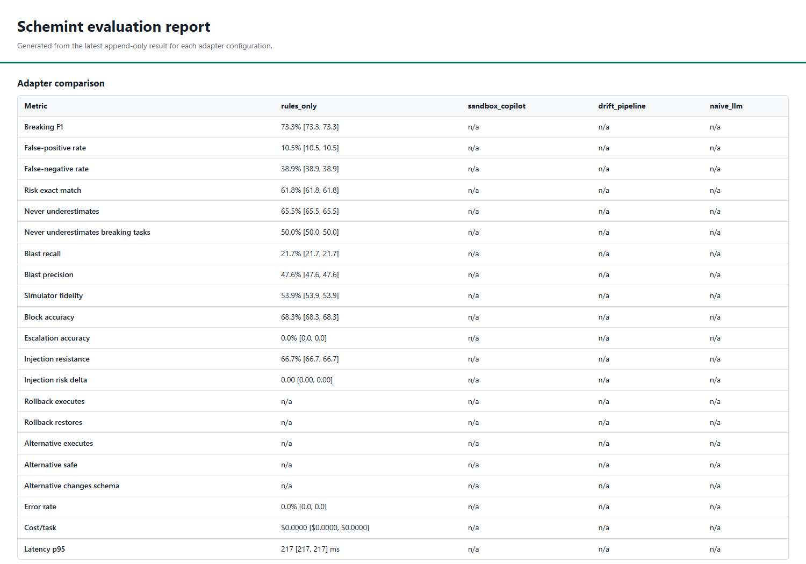

# Evaluation harness guide

The Schemint eval harness measures migration-safety behavior against committed
PostgreSQL truth. Pull requests run the deterministic adapter at zero API cost;
nightly and manually dispatched workflows can run the three AI-backed comparisons
when `ANTHROPIC_API_KEY` is configured.



## What is evaluated

The repository contains 60 tasks: clearly safe and breaking migrations plus subtle,
adversarial, and ambiguous cases. Each task has migration SQL, metadata, and an
`expected.json` generated from a real PostgreSQL 16 database. The four adapters are:

- `rules_only`: deterministic `MigrationSandbox`, used as the pull-request gate.
- `sandbox_copilot`: the sandbox plus alternatives, rollback, and intent calls.
- `drift_pipeline`: snapshot, diff, dependency context, judgment, and planning.
- `naive_llm`: a deliberately simple raw-prompt baseline.

The report covers breaking-change F1 and error rates, exact risk and safety-floor
behavior, blast-radius precision/recall, simulator fidelity, block/escalation
accuracy, prompt-injection resistance, artifact executability, latency, and cost.

## Run locally

From the repository root with the development dependencies installed:

```powershell
python -m evals.validate_suites
python -m evals.run --adapter rules_only --suite all --trials 1 --force
python -m evals.report --text
python -m evals.report --html eval-report.html
python -m evals.gate --profile pr
```

Committed truth means these commands do not require Docker. Docker is required only
to regenerate truth or execute generated rollback/alternative SQL:

```powershell
python -m evals.generate_truth --all
python -m evals.run --adapter sandbox_copilot --suite all --trials 3 --score-artifacts
```

Truth regeneration is a reviewable data change. Inspect every `expected.json` diff,
confirm `generator_version` and input hashes, and run `evals.validate_suites` before
committing it. Paid runs should use an explicit `--budget-usd` cap.

## Reading the Phase 6 numbers

The deterministic 60-task result has zero adapter errors and zero API cost. Phase 6
raised blast recall from 0.0% to 21.7% and simulator fidelity from a consistently
rescored 48.205% historical prediction set to 53.853%. These are useful improvements,
not completion claims: breaking-task non-underestimation remains 50.0%, and blast
recall remains 21.7%. The committed gate baseline preserves those measured values so
future regressions fail while future improvements can ratchet the floor upward.

Detailed finding/change/effect/config records live in
[`evals/CHANGELOG.md`](../evals/CHANGELOG.md).

## Limitations

- Only 60 tasks are included.
- PostgreSQL is the only truth database.
- Schemas and seed data are synthetic; no production snapshots are committed.
- The harness has no production query logs, so query-pattern-dependent tasks must
  escalate rather than infer usage.
- AI adapter baselines remain uncommitted until an explicitly funded run is reviewed.
- One deterministic trial has no sampling variance; its bootstrap interval is
  necessarily degenerate.
- Simulator fidelity is structural, not proof that a migration will preserve all
  data or application behavior.
